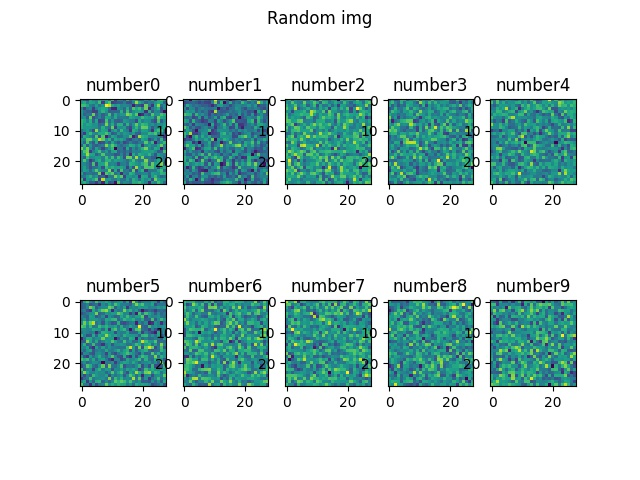
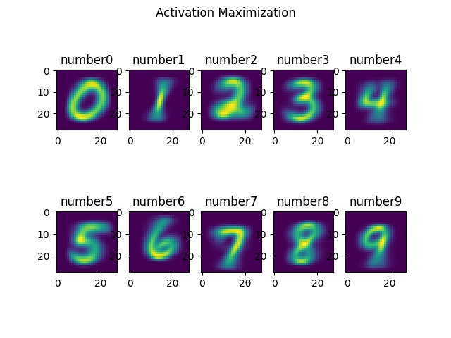

# Activation Maximization

Refet to paper [Methods for interpreting and understanding deep neural networks](https://www.sciencedirect.com/science/article/pii/S1051200417302385)

this method is used to visualize the pre-trained weights by updaing the pixels of a random vector. The main idea is to find a maximum model response for a quantity of interest. It can be one of the approaches for explainable machine learning.

### [code](https://github.com/Thomaszz4/machine-learning/blob/main/activation_maximization.py)

### result 

### the loss function

$max_x \ log \ p(\omega_c|x) \ -\lambda \|x\|^2$

